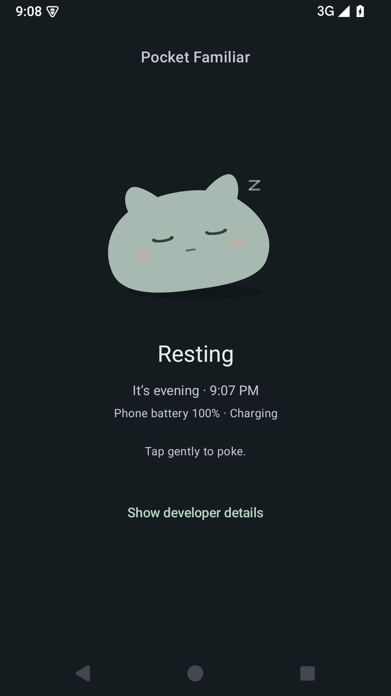
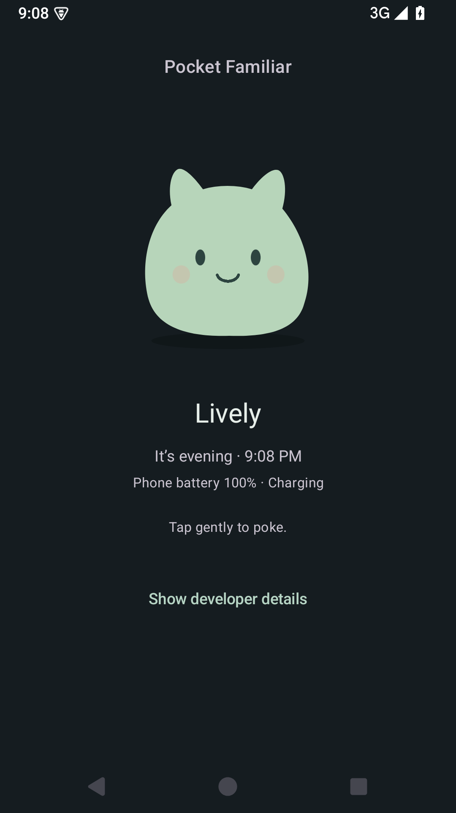

# Pocket Familiar

An Android prototype about a small creature that continues to exist between visits.
v0.2b adds mixed discoveries and optional observations of chosen apps to the v0.2a
AI voice, v0.1b visual expression, and v0.1a persistent simulation.
There is one creature, one screen, a poke, and an on-demand **Listen** action.

The database is canon. The simulation owns state. Behavior is derived from that state;
phone observations do not change it. AI interprets a read-only snapshot and returns
words only. It cannot change state. The creature works offline; listening needs a
configured hosted backend and internet.

## Run

Open this directory in a compatible Android Studio, use the project's configured
JVM toolchain, and install the SDK packages requested by the build files.
Use an Android 8.0 (API 26) or newer device/emulator.

For command-line builds, set `ANDROID_HOME` or create ignored `local.properties`:

```properties
sdk.dir=C\:/path/to/Android/Sdk
```

From PowerShell:

```powershell
.\gradlew.bat testDebugUnitTest assembleDebug lintDebug
.\gradlew.bat installDebug
```

On macOS/Linux, use `./gradlew` (make it executable if needed). The APK is written to
`app/build/outputs/apk/debug/app-debug.apk`.

Dependency and toolchain versions are pinned in the Gradle build files, wrapper
properties, and daemon JVM properties. The wrapper verifies its downloaded
distribution against a pinned SHA-256 checksum. This prototype is not a claim of
current store-release readiness.

## Use

The main screen shows a drawn creature, its behavior, local time of day,
and phone battery/charging context. Tap the creature for a brief reaction. A poke adds
stimulation and records an interaction; it does not restore energy or wake a resting
creature.

Each behavior has a visual pose: resting curls down with closed eyes and slow
breathing, drowsy slouches with heavy eyelids, restless fidgets and looks around,
watchful stands upright and blinks, and lively smiles with a small bob. Pokes cause
a tiny resting twitch, a sleepy stir, or an awake flinch/hop. These are presentation
effects driven by derived behavior. They never mutate canonical state. Idle motion
is active only while the screen is resumed; old poke reactions do not replay when
returning or recreating the screen.

<p>
  
  
</p>

Emulator captures of resting and lively poses using controlled test states.

Expand **Developer details** to inspect canonical values, derived behavior,
timestamps, interaction count, and elapsed time processed by the latest update.
Resume the app or poke to obtain a fresh observation. There are no background jobs,
simulation timers, notifications, or prominent meters.

Tap **Listen** for a checked interesting fact, an original gentle joke, or a playful
observation in the creature's voice. The small catalogue contains 17 materials:
6 sourced facts, 6 jokes, and 5 observation seeds. Facts and jokes are displayed
verbatim, followed by an AI reaction; facts include a link to their source. Current
mode and behavior shape the delivery, including sleepy responses while resting.
Responses aim for 2–4 sentences, with a limit of 80 words and 700 UTF-16 code units.

The last eight displayed material IDs are kept in private app preferences to avoid
recent repeats. This is presentation history, separate from the creature database.
The current thought remains visible when resuming or returning from its source
link. Poking, a new Listen action, or changing voice settings clears it. Thought text is
not saved across app restarts.

## Architecture

One app module, with separate packages under `dev.pocketfamiliar`:

```text
simulation/   Plain Kotlin state, tuning rules, elapsed-time engine, derived behavior
persistence/  Room entity/DAO/database and transactional repository
perception/   Time, battery, optional chosen-app usage sources, observation snapshot
ui/           ViewModel, Compose screen, and transient visual reaction
brain/        Read-only context, text/source response, HTTPS client, private preferences
backend/      Python voice gateway, reviewed catalogue, Railway deployment files
```

`FamiliarApplication` constructs shared dependencies. `MainActivity.onResume()` asks
the ViewModel to refresh. The ViewModel serializes UI operations with a coroutine
mutex; the repository also uses a Room transaction for each read/advance/write.
Every poke advances elapsed time before applying the interaction and commits before
showing the reaction. Concurrent access cannot overwrite a previous interaction.

The only Room table is `creature`, with a single row identified by `1`:

| Column | Type | Meaning |
|---|---|---|
| energy | Float | 0–100 |
| stimulation | Float | 0–100; simulation floor 15 |
| mode | String | `AWAKE` or `RESTING` |
| curiosity | Float | Fixed personality trait, 0–1 |
| createdAt | Long | UTC epoch milliseconds |
| lastUpdatedAt | Long | UTC epoch milliseconds |
| lastInteractionAt | Long? | Null before the first poke |
| interactionCount | Long | Total persisted pokes |

Behavior, environmental observations, animation state, and debug elapsed time are
not persisted. Voice settings, optional app selections, and eight recent discovery
IDs live in private preferences; none are canonical creature state.
`CreatureState` has no Android, Room, UI, or model dependency; its
primitive fields and enum names can be serialized for a future export. `CreatureBrain`
consumes state and an environment snapshot and returns a short text response. Network
work runs outside the simulation mutex, and responses from outdated snapshots are
discarded. The Room schema and simulation rules are unchanged.

Database errors are surfaced for retry; the app does not reset or recreate a creature
to hide them. Schema export is enabled. Future schema changes require explicit
migrations; destructive migration fallback is not enabled. Android cloud backup is
disabled for this local prototype. Clearing app data or uninstalling deletes the
creature; closing, force-stopping, or updating the app preserves it.

## Simulation rules

All tuning values live in `simulation/SimulationRules.kt`.

| Rule | v0.1a value |
|---|---:|
| Initial energy / stimulation / curiosity | 80 / 50 / 0.65 |
| Awake energy loss | 3/hour |
| Awake stimulation loss | 1.5/hour |
| Stimulation floor | 15 |
| Sleep threshold | energy ≤20 |
| Resting energy recovery | 10/hour |
| Wake threshold | energy ≥80 |
| Stimulation while resting | Held steady |
| Poke stimulation increase | +8, capped at 100 |

Behavior precedence is deliberate:

1. `RESTING` if mode is resting.
2. `DROWSY` if awake and energy ≤35.
3. `RESTLESS` if awake and stimulation <30.
4. `LIVELY` if awake, energy ≥60, and stimulation ≥60.
5. `WATCHFUL` otherwise.

Curiosity is fixed and does not yet alter behavior. Low stimulation causes no damage
or escalating penalty; absence simply lets ordinary cycles continue.

The simulator uses elapsed UTC time, not background execution. It processes each
energy threshold and the remaining interval. Inside the normal 20–80 energy range,
every 26-hour period returns to the same energy and mode (20 hours awake, 6 resting).
Whole cycles can therefore be skipped with their awake time accounted for in
stimulation decay. This keeps a years-long absence bounded in work. Calculations use
`Double`, then store `Float`; the `Long` interval remainder preserves the phase even
for very large timestamps.

From the initial state, 20 hours gives resting energy 20; 23 hours gives resting
energy 50; 26 hours gives awake energy 80; 27 hours gives awake energy 77.

If the wall clock moves backward, elapsed time is zero and the previous update
timestamp is retained. Interaction timestamps use that same logical time. A forward
clock change is indistinguishable from real elapsed time in this offline prototype.
No server clock or tamper prevention is added.

## Perception

Time is observed in the phone's current local zone. Coarse periods are night
(22:00–05:59), morning (06:00–11:59), afternoon (12:00–17:59), and evening
(18:00–21:59). Battery readings come from Android's sticky battery broadcast and
account for its reported scale. Unknown readings remain unknown. Charging/full
status is separate from percentage.

Time and battery require no runtime permissions. `PhonePerception` combines their
independent sources with `AppUsagePerceptionSource`; each supplies observations,
not simulation inputs. New sensors can follow this source pattern and extend the
snapshot without creating a parallel simulation.

App observations are optional and off by default. Under **Developer details →
App observations**, enable **Include selected apps**, choose up to eight apps,
and grant Pocket Familiar Android's special **Usage Access** in system settings.
All three controls are required: granting Usage Access alone does not enable sharing.
The chooser lists launchable apps; clearing selections or turning the toggle off
stops app activity from being included.

When enabled, the phone estimates foreground use within the past 60 minutes and
includes at most five chosen app names with rounded approximate minutes on Listen.
Raw Android events and package identifiers stay on the phone; the backend and
OpenAI receive only the reduced names/time summary. Screen contents, messages,
typed text, notifications, and web pages are not read. Android events can be
incomplete, so these are estimates rather than precise activity records. Missing
access or observations leave the ordinary creature and Listen feature working.

## Verification

v0.1b: APK assembly, lint, and 27 JVM tests pass. All five poses were inspected on
an AOSP Android 15 / API 35 emulator. Updating the installed app preserved the
existing creature, and a resting poke persisted without waking it.

The v0.1a baseline also passed all 3 Room integration tests. A launch/poke/force-stop/
reopen check preserved creation and interaction history, advanced real elapsed
time, and displayed a changed battery observation without changing creature energy
to match it. Physical-device usability is still worth checking after the visual update.

JVM tests exercise rates, threshold precedence, sleep/wake boundaries, multiple
offline cycles, long intervals, segmented updates, clock rollback, and resting
pokes. Perception tests cover coarse time and battery mapping.

Room integration tests use a real on-device database, close/reopen it, check offline
catch-up and resting pokes, and verify concurrent interactions are not lost:

```powershell
.\gradlew.bat connectedDebugAndroidTest
```

Manual acceptance check on a device:

1. Launch and expand Developer details. Confirm one creature and initial state.
2. Poke. Confirm the twitch, stimulation increase, and count/timestamp update.
3. Force-stop and relaunch. Confirm identity timestamps and interactions persist.
4. Leave the app closed, return later, and inspect the elapsed-time update.
5. Compare time/battery/charging context against the phone, then resume or poke.
6. Use simulation tests to verify full sleep/wake cycles without waiting a day.
7. Configure the voice service and Listen several times. Check that discoveries
   vary and sourced facts show a working link.
8. Open a fact's source and return. Confirm the discovery remains readable; poke
   and confirm it clears without changing the sleep/wake rules.
9. Optionally enable chosen-app observations and Usage Access. Use a selected app,
   then Listen; check the approximate past-hour summary in developer details.
   Disable observations and confirm the summary is no longer included.

## AI voice setup

Deploy the small gateway on Railway using [the backend instructions](backend/README.md).
Keep the OpenAI API key in Railway variables. Configure the HTTPS URL and a separate
personal access token in the app's developer details, then tap **Listen** to display
one short discovery. This is text, not audible speech or chat. Requests happen only
on that action. Optional app observations require the explicit controls described
above; they never change creature energy or other canonical fields.

v0.2a: APK assembly and lint pass, along with 30 JVM tests, 14 backend tests, and
6 instrumented tests on the dedicated Android 15 emulator (3 voice, 3 Room).
Voice tests use fake model responses. The existing Railway voice connection was
subsequently verified with a live response on the owner's phone.

v0.2b: APK assembly and lint pass, along with 46 JVM tests, 28 backend tests, and
23 instrumented tests on the dedicated Android 15 emulator (7 outbound context,
5 voice/history, 8 app observation settings, 3 Room). Tests use mocked model
responses. The app chooser and an actual selected-app foreground observation were
checked on the emulator; a startup event-ordering regression is covered by tests.
Builds also pass with the GitHub-pinned toolchain and the local Android Studio
upgrade. The new discovery format was also verified through the deployed Railway
gateway with one live provider response and a synthetic context; no phone app
activity was sent in that check. v0.2b was installed as an update on the owner's
Pixel, preserving app data. Interpretation of real selected-app activity still
needs an owner check after opting in. Older APK requests remain supported with
the previous short-thought format.

This prototype intentionally excludes chat, feeding, health, currencies, quests,
accounts, and cloud sync. Its open question is experiential: do persistence,
autonomous cycles, and simple situated observations make the creature feel continuous?
